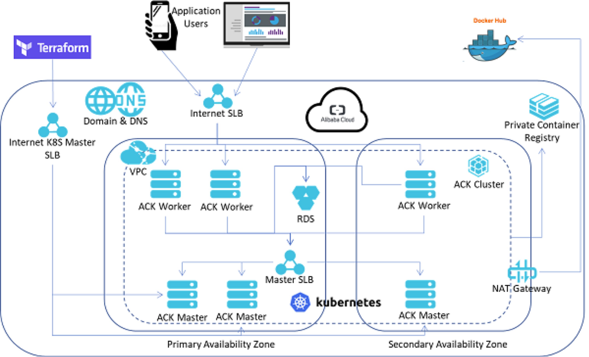

>Github [https://github.com/3dw1np/alicloud-k8s-multi-az-terraform](https://github.com/3dw1np/alicloud-k8s-multi-az-terraform)

# Alibaba Cloud Kubernetes Multi-AZ Kubernetes Cluster Using Terraform

At Alibaba Cloud, we use Terraform to provide fast demos to our customers.
I truly believe that the infrasture-as-code is the quick way to leverage a public cloud provider services. Instead of clicking on the Web Console UI, the logic of the infrasture-as-code allows us to define more accuratly each used services, automate the entire infrastructure and version it with a versionning control (git).

## High-level design



## Export environment variables
We provide the Alicloud credentials with envrionments variables. In this tutorial, we are going to use the US West Region (us-west-1).
 
```
root@alicloud:~$ export ALICLOUD_ACCESS_KEY="anaccesskey"
root@alicloud:~$ export ALICLOUD_SECRET_KEY="asecretkey"
root@alicloud:~$ export ALICLOUD_REGION="us-west-1"
```

If you don't have an access key for your Alicloud account yet, just follow this [tutorial](https://www.alibabacloud.com/help/doc-detail/28955.htm).

## Install Terraform
To install Terraform, download the appropriate package for your OS. The download contains an executable file that you can add in your global PATH.

Verify your PATH configuration by typing the terraform

```
root@alicloud:~$ terraform
Usage: terraform [--version] [--help] <command> [args]
```

## Setup Alicloud terraform provider (> v1.56)
During the init of terraform, the alicloud terraform provider plugin should be downloaded automatically, if not follow the instructions below.
The official repository for Alicloud terraform provider is [https://github.com/alibaba/terraform-provider]() 

* Download a compiled binary from https://github.com/alibaba/terraform-provider/releases.
* Create a custom plugin directory named **terraform.d/plugins/darwin_amd64**.
* Move the binary inside this custom plugin directory.
* Create **test.tf** file for the plan and provide inside:

```
# Configure the Alicloud Provider
provider "alicloud" {}
```

* Initialize the working directory but Terraform will not download the alicloud provider plugin from internet, because we provide a newest version locally.

```
terraform init
```

## Deployment steps

### 🚨 Before start 
Please pay attention, you will be charged for the underlaying resources create by Container Service (and others).


### ⚙️ Paramaters
In the parameters folder, you can change the defaults configurations for the differents solutions stacks.

### 🛠 Launch solutions stacks

##### base_vpc
```bash
terraform init solutions/base_vpc
terraform plan|apply|destroy \
  -var-file=parameters/base_vpc.tfvars \
  -state=states/base_vpc \
  solutions/base_vpc
```

##### cs_k8s
```bash
terraform init solutions/cs_k8s
terraform plan|apply|destroy \
  -var-file=parameters/cs_k8s.tfvars \
  -state=states/cs_k8s \
  solutions/cs_k8s
```

##### deploy_apps
```bash
terraform init solutions/deploy_apps
terraform plan|apply|destroy \
  -var-file=parameters/deploy_apps.tfvars \
  -state=states/deploy_apps \
  solutions/deploy_apps
```

### Terraform modules description

#### vpc
Create a vpc / vswitches / nat gateway / eip in a specific region.

#### cs
Create a K8s cluster with Container Service.

#### rds
Create a RDS MySql for one of the app deployed in K8s.

#### apps
Create a K8s deployment and service for multiples apps. Also DNS recods will be added.